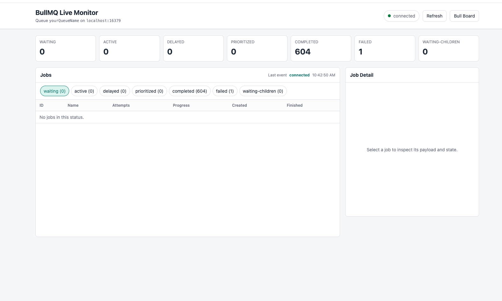

# BullMQ Monitor

BullMQ Monitor is a small Express app for watching one BullMQ queue in realtime.



## About

This project is a lightweight monitor for local or internal BullMQ operations. It adds a read-only realtime dashboard for fast visibility into queue health, job counts, active work, failures, and job details while keeping Bull Board available for operational actions.

It includes:

- A custom read-only realtime dashboard using BullMQ `QueueEvents` and Server-Sent Events.
- Bull Board for queue operations such as retry, remove, clean, pause, and resume.
- JSON APIs for queue summary, job lists, and job details.

## Requirements

- Node.js
- Redis
- A BullMQ queue in Redis

## Setup

Install dependencies:

```bash
npm install
```

Create local config:

```bash
cp .env.example .env
```

Edit `.env` if needed:

```bash
HOST=127.0.0.1
PORT=3100
REDIS_HOST=localhost
REDIS_PORT=16379
QUEUE_NAME=yourQueueName
BASE_PATH=/admin/queues
LIVE_PATH=/live
```

Run the app:

```bash
npm start
```

Open:

- Realtime dashboard: `http://127.0.0.1:3100/live`
- Bull Board: `http://127.0.0.1:3100/admin/queues`
- Health check: `http://127.0.0.1:3100/health`

## Configuration

The app reads `.env` automatically. Exported environment variables take precedence over `.env` values.

| Variable | Default | Description |
| --- | --- | --- |
| `HOST` | `127.0.0.1` | HTTP bind host |
| `PORT` | `3100` | HTTP port |
| `REDIS_HOST` | `localhost` | Redis host |
| `REDIS_PORT` | `16379` | Redis port |
| `QUEUE_NAME` | `yourQueueName` | BullMQ queue name |
| `BASE_PATH` | `/admin/queues` | Bull Board path |
| `LIVE_PATH` | `/live` | Realtime dashboard path |

Example override:

```bash
QUEUE_NAME=anotherQueue npm start
```

## API

### `GET /api/queue/summary`

Returns queue metadata and counts by status.

### `GET /api/jobs?status=waiting&start=0&end=49&asc=false`

Returns a compact paged job list. Supported statuses:

- `waiting`
- `active`
- `delayed`
- `prioritized`
- `completed`
- `failed`
- `waiting-children`

### `GET /api/jobs/:id`

Returns full job details, including data, progress, options, return value, failure reason, and stacktrace.

### `GET /live/events`

Server-Sent Events stream for BullMQ queue events.

## Security Notes

This app is intended for internal/local use.

- There is no authentication.
- Job detail responses may include sensitive payload fields.
- Do not expose this app publicly without adding auth and masking sensitive job data.

## Git Notes

Commit `.env.example`, but do not commit `.env`.
